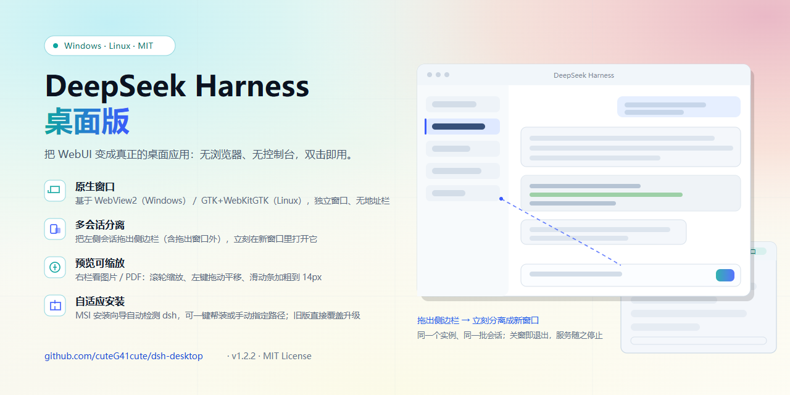

# DeepSeek Harness 桌面版



> 把 [DeepSeek Harness](https://github.com/deepseek-ai/deepseek-harness) 的 WebUI 变成真正的桌面应用程序：
> 无浏览器、无控制台，双击即用，支持多会话分离窗口、系统托盘、自适应安装包（MSI）。

**功能一览：**

- 🪟 **桌面窗口**：基于 Microsoft Edge WebView2，无地址栏/标签栏，双击启动即用；
- 🖥️ **多会话分离**：把左侧会话拖出侧边栏即弹出新窗口，同时查看多个会话；
- 🗂️ **单实例 + 托盘**：重复启动只唤起现有窗口；点 X 最小化到托盘，托盘菜单退出；
- 📦 **自适应安装**：MSI 安装向导自动检测本机 DeepSeek Harness，未安装时可一键帮助安装或手动指定路径；
- 🔍 **预览可缩放**：右栏看图片/PDF 时滚轮缩放、左键拖动平移，滑动条加粗到 14px（详见下文「右侧栏预览」）；
- 🔌 **完全离线可用**：除首次安装 dsh 外不依赖网络。

---

## 快速开始

1. 启动 DeepSeek Harness 的 Web 服务（`dsh web`，后台运行、**全程无控制台窗口**）；
2. 自动打开 WebUI —— **不是浏览器标签页**，而是一个独立的桌面窗口
   （`DSH Desktop.exe`，基于 Microsoft Edge WebView2 内核，无地址栏/标签栏）；
3. **单实例运行**：无论双击多少次启动器/快捷方式，都只会有一个主窗口——
   程序已在运行时，再次启动只是**唤起现有窗口**（若它在托盘里则恢复显示），不会弹出第二个窗口，
   系统托盘里也始终只有一个图标；
4. 点击窗口的 **X（关闭）** 默认**最小化到托盘**：程序在后台继续运行，服务保持开启；
   双击托盘图标（或右键菜单"显示窗口"）可恢复窗口；
5. **退出程序**请使用托盘右键菜单的 **「退出」**：关闭所有窗口，并停止本次启动的服务
   （服务若是别处启动的则不受影响）；
6. **多会话同时显示（拖拽分离窗口）**：在左侧会话列表里**按住一个会话并向右拖出侧边栏**
   （拖到主区域再松手），程序会**新开一个窗口显示该会话**——从此可以同时查看多个会话；
   - 如果拖出的是**当前会话**：新窗口显示它，原窗口自动切到**新会话界面**；
   - 拖出的不是当前会话：原窗口保持不变；
   - 新窗口也是完整的 Harness 窗口（同样支持再次拖出、关闭等操作）；
   - 不想分离时，把会话拖回列表内松手即可（这是原本的排序功能）。

如果服务已经在运行（例如你另开了一个终端跑 `dsh web`），启动器会直接打开窗口，
并且**不会**关闭那个已有的服务。

> 入口说明：`.vbs` 双击后**完全没有控制台窗口**（推荐，桌面快捷方式已指向它）。
> 启动器本身运行在隐藏窗口里，服务进程也没有窗口。
> 本机装有火绒/360 等安全软件，它们会拦截并删除「启动隐藏 PowerShell 的 .cmd 批处理」，
> 因此不再提供 `.cmd` 入口——请使用 `.vbs` 或桌面快捷方式。

---

## 右侧栏预览：缩放 / 平移 / 滑动条（Windows 桌面版）

产品自带的文件预览把图片、PDF 按**原始尺寸**放进右栏（`width:max-content` 的 frame + `overflow:auto` 的文档体），
而右栏通常只有 600px 上下 —— 一张 1373×3051 的手机长截图只能看到一角，而且没有缩放。桌面窗口的注入脚本
（`App.cs` 里的 `PreviewToolsScript()`）在这个视口上补了四件事：

| 操作 | 行为 |
| --- | --- |
| **滚轮** | 以光标为锚点缩放（15%–800%），缩放时右上角短暂显示百分比 |
| **左键拖动** | 平移（图片 / PDF；文本预览保留原生选字） |
| **滑动条** | 右栏右侧与底部从产品的 8px 细条加粗到 **14px**，可直接拖动定位 |
| **双击** | 适宽 ↔ 1:1（100%）切换 |
| Shift+滚轮 | 水平滚动（保留浏览器习惯） |
| Ctrl+滚轮（文本 / 代码） | 缩放文本；**文本预览里普通滚轮仍是滚动**，不影响阅读与选字 |

首次打开预览会浮出一条一次性提示（`滚轮缩放 · 拖动平移 · 双击适宽`）。

> 实现要点：脚本在 `document-start` 注入，所以会等 DOM 就绪后再挂载，并每 700ms 扫描一次以适配预览标签的
> 创建/切换；图片与 PDF 是「滚轮即缩放」，文本/代码是「Ctrl+滚轮缩放」，避免把长文本的常规滚动抢掉。
> 这套只在桌面窗口（WebView2）里生效，浏览器里打开同一个页面不受影响。

## Linux 版（deepin / Ubuntu / Debian）

Windows 版的完整功能已移植到 Linux（GTK + WebKitGTK 原生窗口）：

- 源码与说明：`linux/` 目录（`dsh-desktop` 启动器 + `dsh-desktop.py` 窗口 + `install.sh` 免 root 安装）；
- 安装包：Release 附件中的 `dsh-desktop_1.2.3_amd64.deb`（apt 安装）与 `dsh-desktop-linux-1.2.3.tar.gz`（免 root）；
- 功能对照与已知差异见 `linux/README.md`，真机验证步骤见 `linux/测试指南.md`；
- 打包脚本：`linux/build/build-linux.py`（产出到 `dist\`，Windows/Linux 都能跑）；
- 已修复：软链启动路径、Deepin 密钥环弹窗（ephemeral WebContext）。

## MSI 安装包（推荐分发方式）

**`dist\DeepSeek Harness 桌面版 1.2.3.msi`**（文件名带版本号；安装向导欢迎页亦显示版本，旧版本双击新包即自动升级） 是标准 Windows 安装程序（per-user 安装，无需管理员权限）。
> Release 附件中的同一个安装包写作 ASCII 名 **`DeepSeek-Harness-Desktop-1.2.3.msi`**（GitHub 会改写含中文/空格的附件名）。
双击即进入**安装向导**：

1. **欢迎** → **选择安装目录**（默认 `%LOCALAPPDATA%\Programs\DSH Desktop\`）；
2. **DeepSeek Harness 检测页**（自动检测本机已安装的 DeepSeek Harness）：
   - 已检测到 → 直接【下一步】；
   - 未检测到 → 三个选项：
     - **帮助我安装 DeepSeek Harness**：自动检测 Node.js 并执行 `npm install -g @deepseek-ai/dsh`（日志 `%TEMP%\dsh-msi-npm.log`），完成后返回欢迎页，再点【下一步】即可看到最新检测结果；
     - **手动输入路径**：【验证路径】检查输入位置是否存在 dsh 程序（bin.js/包目录/node_modules 等），验证后返回欢迎页，再点【下一步】查看验证结果；有效则后续安装会写入 `dsh-path.config`；
     - 直接【下一步】跳过：安装后程序首次启动时会自动扫描 dsh；
3. **确认** → **安装** → **完成**。

安装内容与便携版一致（启动器 + 两个入口 vbs + WebView2 桌面程序），并创建
桌面/开始菜单快捷方式（带自定义图标）和控制面板卸载入口。

- **卸载**：控制面板 → 程序 → 卸载「DeepSeek Harness 桌面版」（也可 `msiexec /x <ProductCode>`，
  ProductCode 随版本变化，以控制面板显示为准）；
- **升级**：直接运行新版 MSI 即可覆盖安装；
- 安装前请先**退出正在运行的 DeepSeek Harness 桌面版窗口**（否则程序文件被占用会导致安装失败）；
- 向导的自定义操作使用 VBScript（Windows 11 24H2+ 若已停用 VBScript 需在"可选功能"中启用）。

## 安装程序（自适应，可分发到其他电脑）

双击 **`安装 DeepSeek Harness 桌面版.vbs`** 即可把桌面版**安装**到本机
（`%LOCALAPPDATA%\Programs\DSH Desktop\`），并创建桌面与开始菜单快捷方式。
安装程序会自动适应 DeepSeek Harness 在目标电脑上的安装情况：

1. **自动扫描**已安装的 DeepSeek Harness：
   - npx 缓存（任意 hash 目录）
   - npm 全局安装（`%APPDATA%\npm`、`Program Files\nodejs` 等）
   - `$DSH_HOME\profiles\node_modules`（随 profile 安装的 dsh）
   - PATH 上的 dsh 命令
   找到 → 直接安装桌面版。
2. **未找到** → 询问用户：
   - **「请帮助我安装好 DeepSeek Harness」**：检测 Node.js 依赖 → `npm install -g @deepseek-ai/dsh` → 安装成功后继续装桌面版；
   - **手动输入路径**：验证输入路径下是否存在 dsh 程序（支持 bin.js 文件、包目录、node_modules 目录、
     `@deepseek-ai` 作用域目录等形式）；不存在 → 提醒用户，可**重新输入 / 仍然安装（执意）/ 取消**。
3. 手动指定路径时会把路径写入 `dsh-path.config`（启动器优先使用；若该路径日后失效，启动器会自动回退扫描）。
4. **执意安装**（提供路径下没有 dsh）时，安装完成后会再次警告"桌面版可能无法正常使用"，
   并告知**卸载程序路径**：`%LOCALAPPDATA%\Programs\DSH Desktop\卸载 DeepSeek Harness 桌面版.vbs`。

卸载：运行安装目录里的 **`卸载 DeepSeek Harness 桌面版.vbs`**（或重跑安装包内卸载入口），
会删除桌面版文件与快捷方式（不影响 DeepSeek Harness 服务本身及其数据）。

启动器自身也是自适应的：优先读取 `dsh-path.config`，否则依次扫描 npx 缓存、全局 npm、
`$DSH_HOME\profiles`、PATH；node.exe 同样支持 PATH 与常见安装位置（含 nvm-windows）。

---

## 目录结构

本文件夹就是**桌面版的全部开发与打包内容**（Windows + Linux），可直接当便携版使用：

```
dsh-desktop\
├─ 启动 DeepSeek Harness.vbs     启动入口（中文名，推荐）
├─ Start DeepSeek Harness.vbs    启动入口（英文名，内容相同）
├─ 安装 DeepSeek Harness 桌面版.vbs  安装程序入口（自适应）
├─ launcher.ps1                  启动器（服务检测/启动、Web 认证、开窗、清理）
├─ installer.ps1                 安装程序逻辑（GUI；支持 -SilentInstall/-SilentUninstall）
├─ make-icon.ps1                 图标生成（PNG → 多尺寸 .ico）
├─ DSH Desktop.exe               WebView2 桌面包装程序（+ App.cs / app.ico / *.dll）
├─ dist\                         构建产物：MSI、deb、tar.gz（随 Release 发布）
├─ msi\                          MSI 打包源码：product.wxs / actions.vbs / dsh_zh-CN.wxl
│  ├─ payload\README.md          装进安装目录的说明文件
│  └─ build-msi.ps1              一键打包 MSI（自动暂存载荷 → dist\）
├─ linux\                        Linux 版（GTK + WebKitGTK）
│  ├─ dsh-desktop / dsh-desktop.py / install.sh / dsh-desktop.png
│  ├─ icons\hicolor\…            多尺寸图标
│  ├─ build\build-linux.py       打包 deb + tar.gz（deb 骨架在 build\deb\）
│  ├─ README.md / 测试指南.md
├─ user-data\                    WebView2 独立用户数据（运行时生成）
└─ logs\                         服务日志（运行时生成）
```

**两种布局都支持**（`launcher.ps1` 自动识别包装程序位置）：

| 布局 | launcher.ps1 | DSH Desktop.exe | 说明 |
| --- | --- | --- | --- |
| 开发 / 免安装 | `dsh-desktop\` | 同目录 | 本仓库；整个文件夹拷走即可用 |
| 安装（MSI / installer.ps1） | 安装根 | `dsh-desktop\` 子目录 | `%LOCALAPPDATA%\Programs\DSH Desktop\` |

打包命令（都在本文件夹内执行）：

```powershell
# Windows 安装包 → dist\
powershell -NoProfile -ExecutionPolicy Bypass -File msi\build-msi.ps1

# Linux 安装包 → dist\（Windows/Linux 都能跑）
python3 linux\build\build-linux.py
```

## 文件说明

| 文件 | 作用 |
| --- | --- |
| `安装 DeepSeek Harness 桌面版.vbs` | **安装程序入口**（自适应：扫描/帮助安装/手动路径） |
| `installer.ps1` | 安装程序逻辑（GUI 对话框；`-SilentInstall` / `-SilentUninstall` 供测试/静默部署） |
| `启动 DeepSeek Harness.vbs` | 启动入口（推荐：无任何控制台窗口；中文名） |
| `Start DeepSeek Harness.vbs` | 启动入口（英文名，内容相同） |
| `launcher.ps1` | 核心启动脚本：检测/启动服务、等待就绪、完成 Web 认证（dsh ≥0.1.5）、打开窗口、退出清理（自适应扫描） |
| `DSH Desktop.exe` | WebView2 桌面包装程序（真正的“应用程序窗口”，已嵌入自定义图标） |
| `app.ico` | 程序图标（由 `favicon.png` 生成的 7 尺寸 .ico） |
| `icon-source.png` | 图标源图副本（可用自己的 PNG 替换后重新生成图标） |
| `*.dll / *.xml` | WebView2 运行时托管程序集与原生加载器（来自 NuGet 包） |
| `App.cs` | 包装程序的 C# 源码（单实例/托盘/X=最小化逻辑都在这里，可编辑后重新编译） |
| `make-icon.ps1` | 图标生成脚本：把任意 PNG 转成多尺寸 .ico |
| `msi\build-msi.ps1` | MSI 打包脚本（从本目录取材，产出到 `dist\`） |
| `linux\build\build-linux.py` | Linux 打包脚本（deb + tar.gz，产出到 `dist\`） |
| `dist\` | 构建产物（`DeepSeek Harness 桌面版 <版本>.msi`、`dsh-desktop_<版本>_amd64.deb`、`dsh-desktop-linux-<版本>.tar.gz`） |
| `logs\` | 服务日志（`server.out.log` / `server.err.log`），服务启动失败时自动生成 |
| `user-data\` | WebView2 的独立用户数据目录（首次运行时自动创建） |

> 桌面上的 **`DeepSeek Harness.lnk`** 快捷方式：指向安装目录（或本文件夹）中的 `.vbs`，
> 图标为自定义图标（`.vbs` 文件本身无法携带自定义图标）。
> 安装后桌面/开始菜单快捷方式指向 `%LOCALAPPDATA%\Programs\DSH Desktop\`，
> 本文件夹仍可作为便携版直接使用。

## 更换程序图标

程序默认图标已内嵌于 `DSH Desktop.exe`（源图在 `icon-source.png`）。
想换成自己的图标：准备一张 PNG，重新生成并编译（在**本文件夹**里执行）：

```bat
powershell -NoProfile -ExecutionPolicy Bypass -File make-icon.ps1 -Source <新PNG路径>
"C:\Windows\Microsoft.NET\Framework64\v4.0.30319\csc.exe" /nologo /target:winexe /platform:x64 /optimize+ /codepage:65001 ^
  /out:"DSH Desktop.exe" /win32icon:app.ico /win32manifest:app.manifest ^
  /r:System.dll /r:System.Windows.Forms.dll /r:System.Drawing.dll ^
  /r:Microsoft.Web.WebView2.Core.dll /r:Microsoft.Web.WebView2.WinForms.dll ^
  App.cs
```

> 生成脚本已修正 ICO 的 DIB 行序（GDI+ 内存行序与 ICO 文件要求相反），
> 生成的图标不会再上下颠倒。

## dsh 版本与 Web 认证（dsh ≥ 0.1.5）

从 **dsh 0.1.5** 起，WebUI 增加了浏览器认证，**桌面版已自动适配，用户不需要任何额外操作**：

| 变化 | 说明 |
| --- | --- |
| 未认证访问返回 **401** | 直接打开 `http://127.0.0.1:3080/` 会看到 `dsh web authentication required`，而不是页面 |
| 一次性 token 换 cookie | `dsh web` 会打印 `dsh web: http://127.0.0.1:3080/?token=…`，用它访问一次即可换取一枚最长 30 天有效的签名 cookie（cookie 与「主机:端口」绑定） |
| 默认会打开系统浏览器 | `dsh web` 默认自行弹出浏览器；桌面版启动服务时加了 `--no-open`，改由桌面窗口显示 |

启动器（`launcher.ps1`）的处理顺序：

1. 探测服务时把「200 + `__DSH_BOOT__`」和「401 + dsh 认证提示」**都视为服务已在运行**（后者是新版的正常响应）；
2. 取得认证凭据，按可靠性依次尝试：
   - **自行签发并验证 cookie**：签名密钥是持久的（`%USERPROFILE%\.dsh\.credentials.yaml` 里的
     `client-connection/browser-session` 记录），启动器按 dsh 的格式算出 cookie，再用一次真实
     HTTP 请求确认服务端接受它，然后通过 `DSH_DESKTOP_AUTH_COOKIE` 交给窗口注入 WebView2 ——
     **因此即使 WebUI 是你在别处手动启动的（读不到 token 日志）也能正常认证**；
   - 退回**认证 URL**：从启动日志取 `dsh web: http://…?token=…`，直接用该地址开窗；
   - 都没有：照旧打开原地址（若 WebView2 配置里已有有效 cookie 仍可正常显示）。
3. 窗口地址始终是干净地址（不带 token），token 不会留在窗口标题/历史里。

> 若将来 dsh 改了密钥存放或 cookie 格式，验证会失败并自动退回认证 URL 方式；两者都不可用时，
> 窗口会显示 401 提示页，按页面提示用 `dsh web` 打印的带 token 地址打开一次即可（cookie 可管 30 天）。

## 工作原理

- 服务地址固定为 `http://127.0.0.1:3080`（与 `dsh web` 的默认端口一致）。
- 启动器先探测该地址是否已在提供 Harness 页面（含 `__DSH_BOOT__` 特征），未运行才启动服务；
  dsh ≥0.1.5 未认证时返回的 401（正文含 dsh 认证提示）同样算「服务已在运行」，
  这样重复双击不会拉起第二个服务实例。
- 启动服务时使用 `dsh web --no-open`：新版 dsh 默认会自己弹出系统浏览器，桌面版必须禁用，
  否则会同时出现浏览器标签页和桌面窗口。
- Web 认证（dsh ≥0.1.5）由启动器完成：签发并验证 cookie → 通过环境变量交给窗口 →
  `DSH Desktop.exe` 在首次导航前把它写入 WebView2 配置（详见上一节）。
- 桌面窗口是用 **WebView2**（Windows 10/11 自带或随 Edge 安装）嵌入的本地窗口，
  与浏览器完全隔离：独立的用户数据目录、无标签页、无地址栏。
- **单实例**由 `DSH Desktop.exe` 用命名互斥体实现：重复启动时向现有实例发送"显示"信号并以
  退出码 42 结束；启动器识别 42 后**不会**停止服务（否则第二次双击会误杀第一次启动的服务）。
- 系统托盘与 X=最小化到托盘由 `DSH Desktop.exe` 实现；托盘菜单「退出」后启动器的
  `WaitForExit` 返回，随即停止它本次启动的服务进程（服务不是启动器拉起的则不动）。
- 回退链：找不到 `DSH Desktop.exe` 时改用 Edge/Chrome 的“应用模式”（`--app=`，同样是无边框独立窗口），
  再不行才用默认浏览器打开（该回退下服务会保持运行）。

## 重新编译桌面包装程序（可选）

不需要安装 .NET SDK，Windows 自带的 .NET Framework C# 编译器即可（在**本文件夹**里执行）：

```bat
"C:\Windows\Microsoft.NET\Framework64\v4.0.30319\csc.exe" /nologo /target:winexe /platform:x64 /optimize+ /codepage:65001 ^
  /out:"DSH Desktop.exe" /win32icon:app.ico /win32manifest:app.manifest ^
  /r:System.dll /r:System.Windows.Forms.dll /r:System.Drawing.dll ^
  /r:Microsoft.Web.WebView2.Core.dll /r:Microsoft.Web.WebView2.WinForms.dll ^
  App.cs
```

> `/codepage:65001` 不可省略：`App.cs` 是 UTF-8 无 BOM 源码，缺了它中文界面字符串会变成乱码。
> 重编译后如需分发，记得重新打包：`msi\build-msi.ps1`。

## 常见问题

- **双击后没反应？** 检查 `logs\server.err.log`；最常见原因是 3080 端口被其他程序占用，
  或 `dsh` 尚未安装（先运行一次 `npx @deepseek-ai/dsh web` 或全局安装 `@deepseek-ai/dsh`）。
- **想改端口？** 编辑 `launcher.ps1` 顶部的 `$Url`（服务端口会自动跟随该地址）。
- **第一次打开较慢？** WebView2 首次启动会初始化独立用户数据目录，属正常现象。
- **程序不见了但服务还在？** 点 X 或最小化时默认进入系统托盘（关闭即最小化），双击托盘图标即可恢复窗口；
  彻底退出请用托盘右键菜单的「退出」。
- **双击了很多次只有两个窗口？** 单实例模式下重复启动只会唤起现有窗口；若仍出现多个窗口，
  说明有旧版本进程残留，可在任务管理器中结束所有 `DSH Desktop.exe` 后重试。
---

## 宣传图


| 文件 | 说明 |
| --- | --- |
| `docs/banner.svg` | 矢量源文件（1280×640，纯 SVG：无脚本、无外链字体、无位图依赖，可直接改文案重新导出） |
| `docs/banner.png` | 渲染成品（1280×640，正好也是 GitHub 社交预览图的标准尺寸） |

> 想换文案或配色：改 `docs/banner.svg` 后重新导出 PNG 即可（任何浏览器打开 SVG → 截图，或 `rsvg-convert`／Inkscape）。
> 建议同时把 `docs/banner.png` 上传到 **仓库 Settings → Social preview**，这样链接分享出去时的卡片就是这张图。